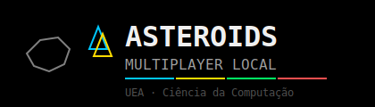

<p align="center">
  
</p>

<p align="center">
  Versão multiplayer local do clássico Asteroids para até <strong>4 jogadores simultâneos</strong>,<br>
  com controles Tectoy, modos de jogo variados e mecânicas inéditas por integrante da equipe.<br>
  <em>Atividade 007 | UEA · Tópicos Especiais I</em>
</p>

---

<h2 align="center">🎮 Tecnologias Utilizadas</h2>

<p align="center">
  
  
  
  
</p>

---

<h2 align="center">📝 Descrição do Projeto</h2>

Este projeto é uma versão **multiplayer local** do jogo Asteroids, baseada no repositório original do professor [jucimarjr/asteroids_pygame](https://github.com/jucimarjr/asteroids_pygame).

O objetivo é transformar o jogo singleplayer em uma experiência divertida para **2 a 4 jogadores simultâneos**, com controles mapeados para os controles Tectoy disponibilizados em sala, interface adaptada para múltiplos jogadores e mecânicas inéditas desenvolvidas por cada integrante da equipe.

---

<h2 align="center">🕹️ Modos de Jogo</h2>

O modo é selecionado no menu inicial com as **teclas seta esquerda e direita**. Cada modo define as regras de aliança, fogo amigo, resgate e condição de vitória.

<br>

**Solo**

Um único jogador enfrenta ondas de asteroides e OVNIs no modo clássico. Não há aliados nem fogo amigo. O jogo termina quando o jogador perde todas as vidas.

<br>

**Cooperativo (2 a 4 jogadores)**

Todos os jogadores formam um único time e enfrentam juntos os asteroides e OVNIs. Não há fogo amigo. O jogo termina quando todas as naves forem destruídas. Mecânicas de cooperação entre aliados ficam ativas neste modo.

<br>

**Duelo (2 jogadores)**

Partida 1 contra 1. O fogo amigo está ativo: os jogadores podem se acertar mutuamente. Não há cooperação entre eles. Vence quem sobreviver por último, seja destruindo o adversário ou sendo o único a resistir aos asteroides.

<br>

**Todos vs Todos (2 a 4 jogadores)**

Cada jogador compete por conta própria. O fogo amigo está ativo para todos. Vence quem sobreviver por último. É possível ser eliminado tanto pelos asteroides quanto pelos outros jogadores.

<br>

**Equipes 2v2 (4 jogadores)**

Os jogadores são divididos em duas equipes fixas: **Equipe A** (J1 e J2) contra **Equipe B** (J3 e J4). Dentro de cada equipe não há fogo amigo e mecânicas de cooperação ficam ativas. Entre equipes adversárias o fogo amigo está ativado. Vence a equipe que eliminar todos os adversários.

---

<h2 align="center">🎯 Funcionalidades Multiplayer</h2>

| Funcionalidade | Descrição |
|---|---|
| **2 a 4 jogadores** | Selecionável no menu inicial |
| **Cores por jogador** | Ciano (J1), Amarelo (J2), Verde (J3), Vermelho (J4) |
| **Pontuação individual** | Cada jogador acumula pontos separadamente |
| **Vidas individuais** | Cada nave tem 3 vidas independentes |
| **HUD dividido** | Topo da tela dividido em seções por jogador, com vidas, pontos e estado do EMP |
| **Placar final** | Ranking por pontos ao encerrar a partida |
| **OVNI inteligente** | Mira automaticamente na nave viva mais próxima |
| **Fogo amigo** | Ativo nos modos competitivos (Duelo, Todos vs Todos, Equipes) |

---

<h2 align="center">✨ Mecânicas Inéditas</h2>

Cada integrante da equipe implementou uma mecânica inédita no jogo.

<br>

**Juliana Ballin Lima - Sistema de Resgate**

Quando um jogador perde todas as suas vidas nos modos Cooperativo ou Equipes, sua nave se transforma em uma **carcaça piscante** que permanece no mapa por 10 segundos. Qualquer aliado que aproxime sua nave da carcaça e permaneça a menos de 80 pixels por 3 segundos consecutivos completa o resgate: o jogador eliminado retorna com 1 vida na posição da carcaça, e o resgatador recebe 500 pontos de bônus. Uma barra de progresso verde indica o andamento do resgate. Se ninguém resgatar a tempo, a carcaça desaparece permanentemente.

<br>

**Ana Beatriz Maciel Nunes**

*(mecânica a implementar)*

<br>

**Fernando Luiz da Silva Freire**

*(mecânica a implementar)*

---

<h2 align="center">🎮 Controles (Tectoy)</h2>

| Jogador | Esquerda | Direita | Acelerar | Fogo | Pulsar EMP |
|---|---|---|---|---|---|
| **J1** | `A` | `D` | `W` | `LSHIFT` | `Q` |
| **J2** | `←` | `→` | `↑` | `RSHIFT` | `P` |
| **J3** | `J` | `L` | `I` | `H` | `Y` |
| **J4** | `Num4` | `Num6` | `Num8` | `Num0` | `NumEnter` |

> **Pulsar EMP:** mesmas teclas de antes, espera antes de repetir; empurra asteroides. Outra nave no alcance da onda: mesmo time/coop ganha invulnerabilidade curta; duel, todos-vs-todos ou equipa adversária ficam com rotação mais lenta uns segundos. Quem dispara não leva esse “lerdo”.

---

<h2 align="center">📁 Estrutura do Projeto</h2>

```text
asteroids-multiplayer-local/
├── src/
│   ├── main.py        # ponto de entrada
│   ├── config.py      # constantes, cores e controles por jogador
│   ├── game.py        # loop, menus, HUD e placar
│   ├── sprites.py     # entidades: Nave, Bala, Asteroide, OVNI, Carcaca
│   ├── systems.py     # gerenciador do mundo e logica dos modos de jogo
│   └── utils.py       # funções matematicas e de desenho
├── docs/
│   └── diagrams/
│       ├── logo.svg
│       ├── c4_nivel1_contexto.puml
│       ├── c4_nivel2_container.puml
│       └── c4_nivel3_componente.puml
├── requirements.txt
└── README.md
```

---

<h2 align="center">▶️ Como Executar</h2>

**1. Clonar o repositório**

```bash
git clone https://github.com/JulianaBallin/asteroids-multiplayer-local.git
cd asteroids-multiplayer-local
```

**2. Criar ambiente virtual**

```bash
python -m venv .venv
source .venv/bin/activate        # Linux/Mac
# .venv\Scripts\activate         # Windows
```

**3. Instalar dependências**

```bash
pip install -r requirements.txt
```

**4. Iniciar o jogo**

```bash
python src/main.py
```

---

<h2 align="center">📦 Dependências</h2>

```txt
pygame>=2.5.0
```

---

<h2 align="center">🗺️ Diagramas C4</h2>

Os diagramas estão na pasta `docs/diagrams/` em formato PlantUML (`.puml`).

Para renderizá-los, use o [PlantUML Online Server](https://www.plantuml.com/plantuml/uml/) ou o plugin PlantUML no VS Code.

| Arquivo | Nivel | Descricao |
|---|---|---|
| `c4_nivel1_contexto.puml` | Nivel 1 | Visao geral do sistema e usuarios |
| `c4_nivel2_container.puml` | Nivel 2 | Containers da aplicacao |
| `c4_nivel3_componente.puml` | Nivel 3 | Componentes internos da aplicacao |

---

<h2 align="center">⚠️ Limitações</h2>

- Suporte apenas a teclado (sem joystick USB nesta versão)
- Ate 4 jogadores simultâneos no mesmo teclado
- Jogo reinicia do zero a cada partida (sem salvamento de pontuação)

---

<h2 align="center">📚 Referências</h2>

- Repositório original: [jucimarjr/asteroids_pygame](https://github.com/jucimarjr/asteroids_pygame)
- Documentação do pygame: [pygame.org/docs](https://www.pygame.org/docs/)
- C4 Model: [c4model.com](https://c4model.com)

---

<h2 align="center">👥 Equipe</h2>

<p align="center">

| Nome |
| ---- |
| Ana Beatriz Maciel Nunes |
| Fernando Luiz Da Silva Freire |
| Juliana Ballin Lima |

</p>

---

<h3 align="center">UEA · Tópicos Especiais I · Atividade 007: Multiplayer Local</h3>
